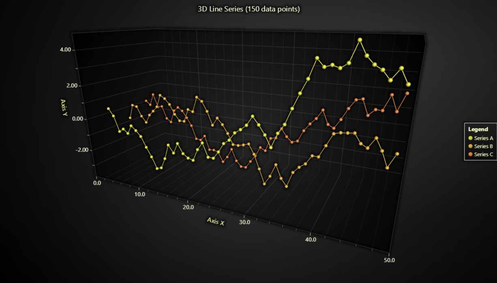

# JavaScript 3D Line Series



This demo application belongs to the set of examples for LightningChart JS, data visualization library for JavaScript.

LightningChart JS is entirely GPU accelerated and performance optimized charting library for presenting massive amounts of data. It offers an easy way of creating sophisticated and interactive charts and adding them to your website or web application.

The demo can be used as an example or a seed project. Local execution requires the following steps:

-   Make sure that relevant version of [Node.js](https://nodejs.org/en/download/) is installed
-   Open the project folder in a terminal:

          npm install              # fetches dependencies
          npm start                # builds an application and starts the development server

-   The application is available at _http://localhost:8080_ in your browser, webpack-dev-server provides hot reload functionality.


## Description

_Also known as a Line Graph or Line Chart_

This example shows the basic usage of a 3D line series. The line series is drawn on a Cartesian coordinate system and represents the relationship between two variables. Line series display information as a series of data points connected by straight line segments. They are most often used to visualize the changes in data or reveal trends in a dataset.

This type of series does not contain the visual representation of 'markers' for the data points but only continuously connected line between all of them. Additionally, it allows drawing lines in any direction.

The chart can be created with few simple lines of code:

```javascript
// Create a new ChartXY.
const chart3D = lightningChart().Chart3D()

// Add a line series using default X, Y and Z axes.
const series = chart3D.addLineSeries()
```

The series accepts points in format `{ x: number, y: number, z:number }`. Any number of points can be added with a single call.

```javascript
// Single point.
series.add({ x: 50, y: 60, z: 40 })

// Multiple points at once.
series.add([
    { x: 55, y: 60, z: 60 },
    { x: 60, y: 62, z: 50 },
    { x: 65, y: 65, z: 60 },
])
```


## API Links

* [3D chart]
* [3D line series]


## Support

If you notice an error in the example code, please open an issue on [GitHub][0] repository of the entire example.

Official [API documentation][1] can be found on [LightningChart][2] website.

If the docs and other materials do not solve your problem as well as implementation help is needed, ask on [StackOverflow][3] (tagged lightningchart).

If you think you found a bug in the LightningChart JavaScript library, please contact sales@lightningchart.com.

Direct developer email support can be purchased through a [Support Plan][4] or by contacting sales@lightningchart.com.

[0]: https://github.com/Arction/
[1]: https://lightningchart.com/lightningchart-js-api-documentation/
[2]: https://lightningchart.com
[3]: https://stackoverflow.com/questions/tagged/lightningchart
[4]: https://lightningchart.com/support-services/

© LightningChart Ltd 2009-2022. All rights reserved.


[3D chart]: https://lightningchart.com/js-charts/api-documentation/v6.0.0/classes/Chart3D.html
[3D line series]: https://lightningchart.com/js-charts/api-documentation/v6.0.0/classes/LineSeries3D.html

